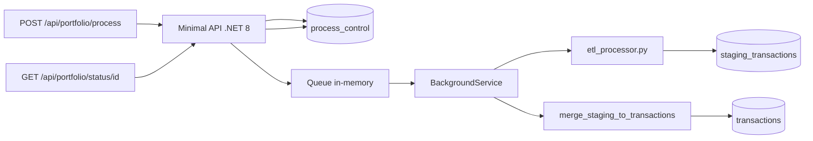

# TransactionCloseExchange - Prueba Técnica Backend 2026

Implementación del reto **Ingesta Financiera Masiva & Valoración Asíncrona** con:

- **Python (Polars + psycopg)** para limpieza y carga bulk a staging.
- **PostgreSQL** con patrón **Staging -> Producción** e idempotencia por `ON CONFLICT`.
- **.NET 8 Minimal API** para orquestación asíncrona y consulta de estado.

## Arquitectura (Mermaid)



## Estructura

- `src/api` -> Minimal API + worker asíncrono
- `scripts/python/etl_processor.py` -> ETL parquet -> staging (bulk COPY)
- `scripts/python/data_generator.py` -> generador opcional de CSV masivo
- `scripts/sql/001_schema.sql` -> DDL + tablas + índices
- `scripts/sql/002_merge_staging_to_prod.sql` -> función idempotente de merge

## Idempotencia aplicada

1. **Ingesta/batch**: `source_hash` único en `process_control` evita reprocesar archivo idéntico ya completado.
2. **Datos/fila**: `transaction_id` técnico + `UNIQUE(transaction_id, source_system)` en producción.
3. **Upsert inteligente**: `ON CONFLICT DO UPDATE` solo cuando cambia `payload_hash`.
4. **Orquestación**: transición atómica `Pending -> Running` evita doble ejecución concurrente.

## Requisitos

- .NET SDK 8
- Python 3.11+
- PostgreSQL 14+

## Levantar entorno

### 1) Crear base de datos

```sql
CREATE DATABASE transaction_close_exchange;
```

### 2) Ejecutar scripts SQL

```powershell
psql -h localhost -U postgres -d transaction_close_exchange -f scripts/sql/001_schema.sql
psql -h localhost -U postgres -d transaction_close_exchange -f scripts/sql/002_merge_staging_to_prod.sql
```

### 3) Instalar dependencias Python

```powershell
python -m pip install -r scripts/python/requirements.txt
```

### 4) Configurar conexión PostgreSQL

Editar `src/api/appsettings.json` en `ConnectionStrings:Postgres`.

### 5) Ejecutar API

```powershell
dotnet run --project src/api/TransactionCloseExchange.Api.csproj
```

### 6) Probar endpoints en Swagger

Con la API corriendo, abre:

- `http://localhost:5000/swagger` o
- `https://localhost:5001/swagger`

Desde allí puedes ejecutar `POST /api/portfolio/process` y `GET /api/portfolio/status/{id}` sin Postman.

## Uso de endpoints

### Iniciar proceso (202 async)

```http
POST /api/portfolio/process
Content-Type: application/json

{
  "sourcePath": "fondos_500mb.parquet",
  "sourceSystem": "ExternalProvider"
}
```

Respuesta:

```json
{
  "processId": "...",
  "status": "Pending",
  "sourceHash": "..."
}
```

### Consultar estado

```http
GET /api/portfolio/status/{processId}
```

Devuelve estado (`Pending`, `Running`, `Completed`, `Failed`), timestamps y métricas.

## Decisiones de diseño

- **Staging sin restricciones fuertes** para máxima velocidad de escritura (bulk `COPY`).
- **Validación pesada en ETL** y consolidación de reglas en merge SQL transaccional.
- **No inserción fila por fila**: todas las cargas a staging son por bloques.
- **Reintentos seguros**: si un proceso falla, un nuevo POST del mismo `source_hash` lo reprograma sin duplicar saldos.

## Generación de CSV (opcional)

```powershell
python scripts/python/data_generator.py --rows 5000000 --output transactions_5000000.csv
```
